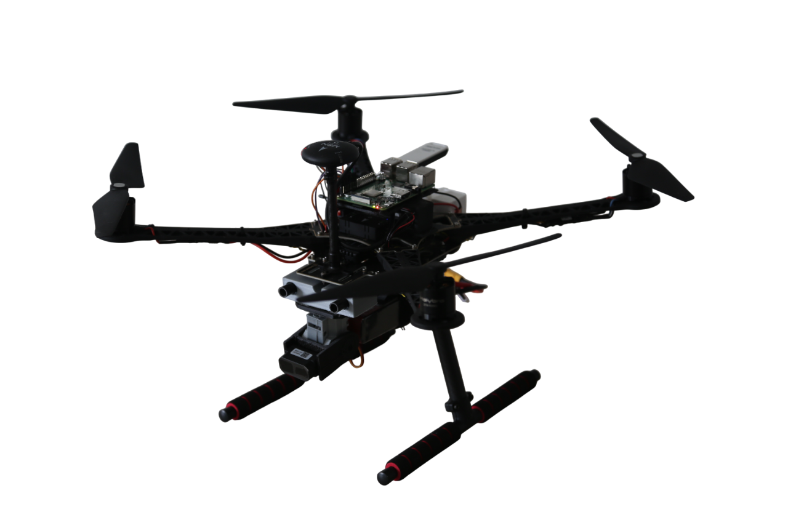
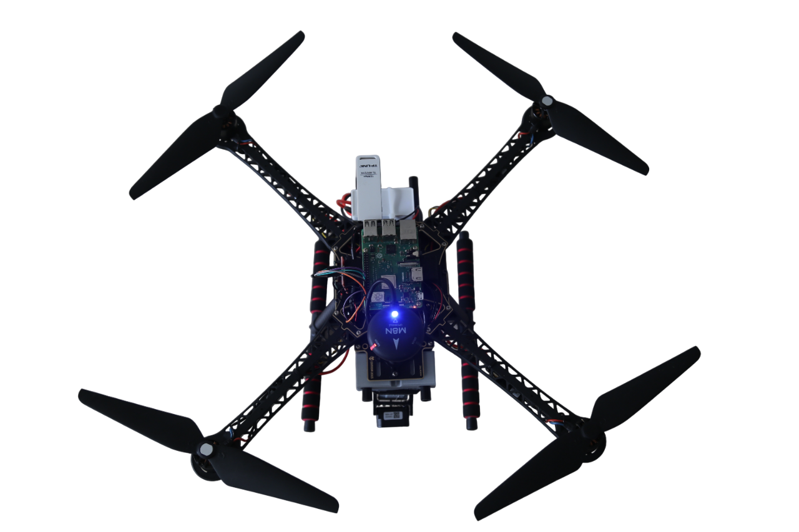
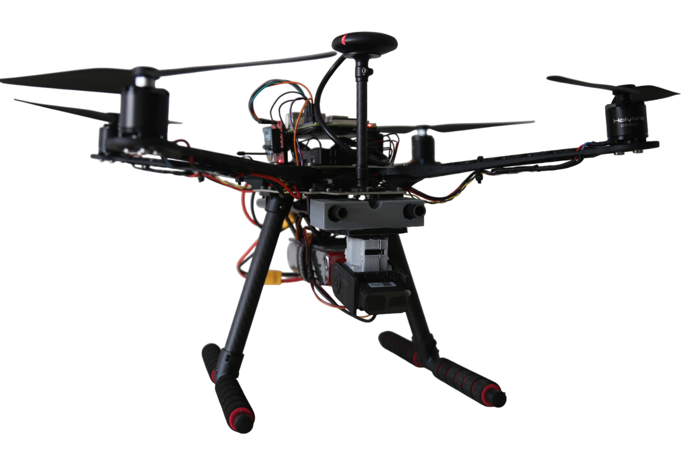
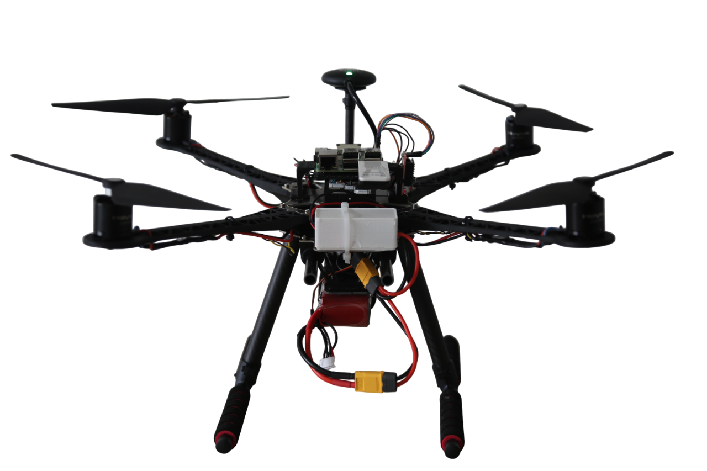
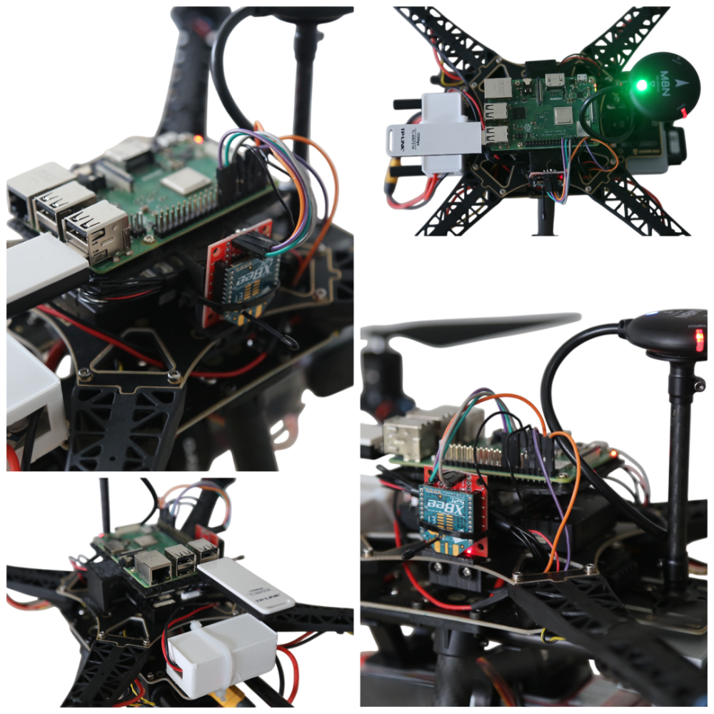

# Drone Frame and Parameter
The [Holybro S500 drone model](https://holybro.com/products/s500-v2-kit) is used for testing the implementation of VESPA

**Parameter Tuning:** A list of parameters is provided showes some parameters for controlling the drone ( such as Telemetry pins) , but each drone requires individual tuning with precise values to optimize performance also calibration settings are unique to each drone to ensure accurate and reliable operation.

Assembly Images: Below are images of the drone after mounting all structures and peripherals.

  <!-- First row: images 1 and 2 -->
  
  

  <!-- Second row: images 3 and 4 -->
  
  

<!-- Centered image 10 with a separate full-width div -->

  

