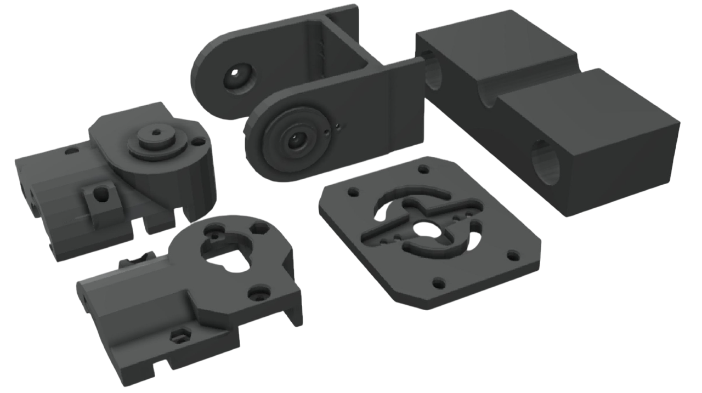
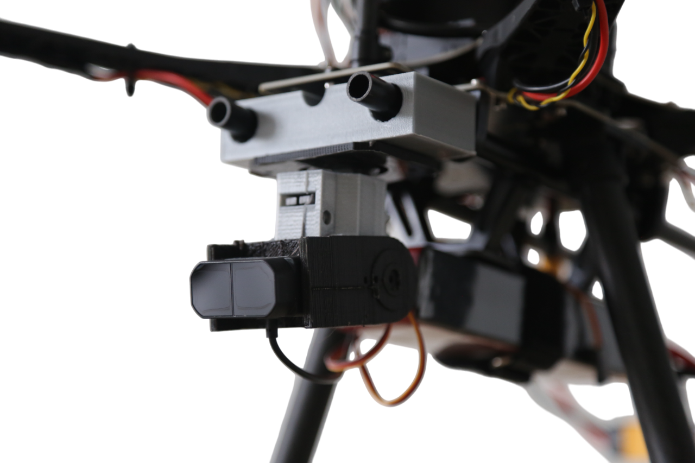

# Pan-Tilt Platform Overview
This pan-tilt platform is a compact assembly designed to provide precise horizontal and vertical movement. It features the following components:

**Servo Motors:** The platform includes two SER0049 servo motors. [SER0049 Product Link]( https://www.mouser.fr/ProductDetail/DFRobot/SER0049?qs=zW32dvEIR3v8TNYUOYSkXg%3D%3D)

**Mounting and Structure:**
The servo motors are positioned between two main structural parts, referred to as Face 1 and Face 2.
The Base serves as the anchor point for the first servo motor, allowing for smooth rotational motion.
An Arm is connected to the second servo motor and moves horizontally.

**Lidar Placement:** At the end of the Arm, a Lidar sensor is mounted, enabling precise scanning at various angles.

**Drone Attachment**: The entire platform is secured to the drone using a base holder specifically designed to slide onto the structure of [Holybro S500 V2 kit](https://holybro.com/products/s500-v2-kit).

This setup enables controlled movement in both axes, providing a stable and adjustable mounting solution for applications requiring precise targeting or scanning.

For a visual reference of the mount's integration with the drone frame, refer to the drone image showing how the structure aligns and secures within the frame.

<!-- Centered image 10 with a separate full-width div -->

  

