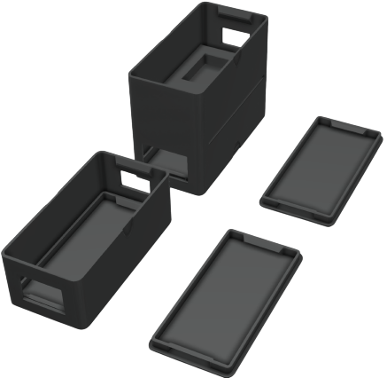
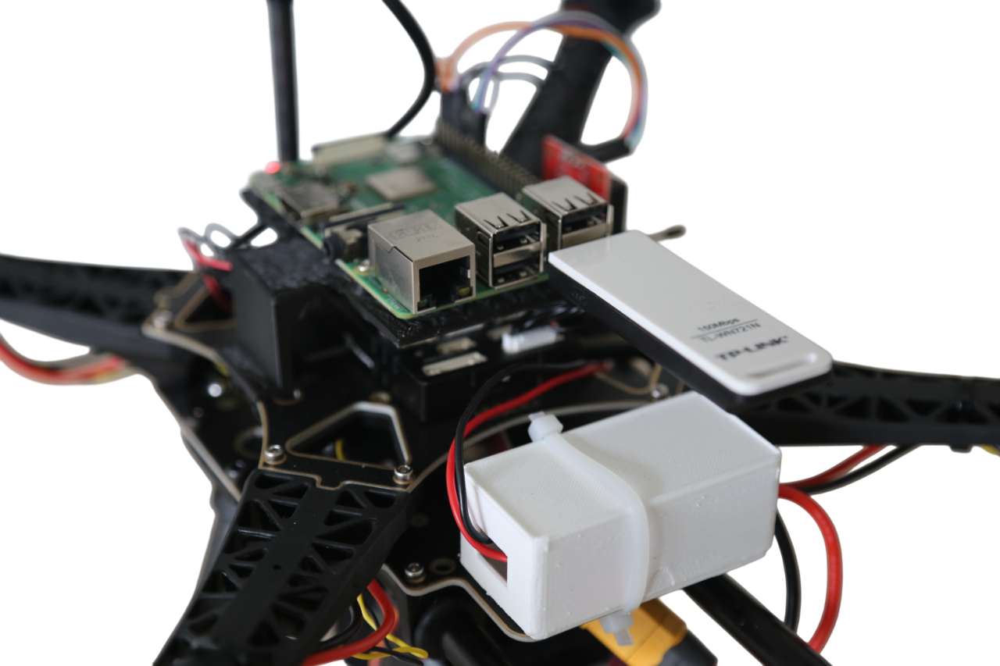

# Power case Descriptions

## 1. Double Case Holder:
* First Level: Holds the [Power module DC-DC Buck Converter](https://www.amazon.fr/dp/B07XRF9NWP?ref=ppx_yo2ov_dt_b_fed_asin_title) to supply power to the Pixhawk and Raspberry Pi.
* Second Level: Designed to hold the ESP32 for [Objects_detection_lidar](https://github.com/SulaimanMohammad/Drone_VESPA/tree/main/src/Lidar/ESP/Objects_detection_lidar).

## 2. Power Module Case (Single Case)
Designed solely for the power module. Ideal if you do not require the ESP32 or LiDAR detection system.

Lids: are included to cover and protect the entire structure.

For a visual reference of the mount's integration with the drone frame, refer to the drone images showing how the structure aligns and secures within the frame.

<!-- Centered image 10 with a separate full-width div -->

  
  

