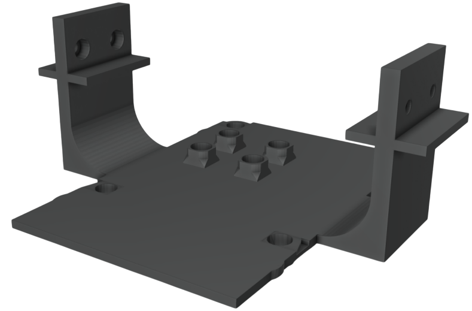

#  Mounting Raspberry Pi on Drone
Mounts the Raspberry Pi on top of the Pixhawk to facilitate communication between the two devices
* **Positioning:** Sits on top of the Pixhawk, allowing close and stable connection for efficient communication.
* **Slide-in Structure:** Designed to slide into the drone’s frame, providing a secure fit.
* **Screw Holders:** Includes screw holders on each side to ensure stability, keeping the Raspberry Pi firmly in place during flight.

For a visual reference of the mount's integration with the drone frame, refer to the drone images showing how the structure aligns and secures within the frame.

